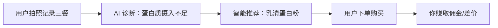
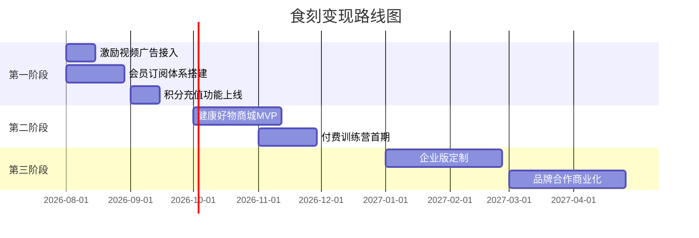

# 🎯「食刻」小程序变现策略全景分析

## 产品现状盘点

你的「食刻」目前拥有以下核心能力：

| 模块 | 功能 | 用户价值 | 变现潜力 |
| :--- | :--- | :--- | :--- |
| 📸 AI 拍照识图 | 拍照自动识别食物热量与营养素 | ⭐⭐⭐⭐⭐ 核心刚需 | 🔥🔥🔥🔥🔥 |
| 🥗 全景营养诊断 | AI 专家级三餐复盘评分与建议 | ⭐⭐⭐⭐⭐ 高频使用 | 🔥🔥🔥🔥 |
| 🎯 AI 7天定制计划 | 运动+饮食个性化方案 | ⭐⭐⭐⭐ 中高频 | 🔥🔥🔥🔥🔥 |
| 💧 饮水打卡提醒 | 定时推送+记录 | ⭐⭐⭐ 粘性工具 | 🔥🔥 |
| 🏃 运动打卡记录 | 热量消耗追踪 | ⭐⭐⭐⭐ 日常刚需 | 🔥🔥🔥 |
| 👥 小队挑战 | 社交激励+排行榜 | ⭐⭐⭐⭐ 拉新利器 | 🔥🔥🔥 |
| 🏅 契约积分体系 | 签到/打卡赚积分 | ⭐⭐⭐ 留存抓手 | 🔥🔥🔥🔥 |
| 📊 海报分享 | 打卡成就海报 | ⭐⭐⭐ 传播裂变 | 🔥🔥 |

---

## 第一梯队：短期可落地（1-2 个月内）

### 1. 💎 会员订阅制（核心变现引擎）

> [!IMPORTANT]
> 这是最适合你产品形态的首选变现方式，也是健康类 App 行业验证最成熟的模式。

**分层设计：**

```
┌─────────────────────────────────────────────────┐
│  🆓 免费用户                                      │
│  • AI 拍照识图：每天 3 次                          │
│  • AI 营养诊断：每天 1 次                          │
│  • AI 定制计划：首次免费，之后消耗积分              │
│  • 运动/饮水打卡：不限                             │
│  • 基础统计报告                                    │
├─────────────────────────────────────────────────┤
│  ⭐ 月度会员 ¥9.9/月                              │
│  • AI 拍照识图：无限次                             │
│  • AI 营养诊断：无限次                             │
│  • AI 定制计划：每月免费重新生成 2 次               │
│  • 专属会员标识 + 小队特权                         │
│  • 周报/月报深度分析                               │
├─────────────────────────────────────────────────┤
│  👑 年度会员 ¥68/年（¥5.7/月，省42%）              │
│  • 包含月度会员全部权益                            │
│  • AI 定制计划：无限次重新生成                     │
│  • 历史数据导出                                    │
│  • 专属客服 + 优先体验新功能                       │
│  • 赠送 500 契约积分                               │
└─────────────────────────────────────────────────┘
```

**为什么这个定价合理？**
- 你的 AI 成本：每次调用 ≈ 0.0002 元
- 月度会员 ¥9.9，假设用户每天用 5 次 AI = 150 次/月 = 成本 0.03 元
- **毛利率 > 99%**，几乎全是纯利润

**实现难度：** ⭐⭐（低）— 前端加一个会员购买页 + 后端加使用次数限制即可

---

### 2. 🎬 激励视频广告（零门槛被动收入）

> [!TIP]
> 微信小程序激励视频广告 eCPM 通常在 ¥30-80/千次曝光，是最不影响体验的广告形式。

**嵌入场景设计（用户主动选择观看，不打扰）：**

| 触发场景 | 用户获得 | 你的收入 |
| :--- | :--- | :--- |
| 免费用户 AI 识图次数用完 | 看广告 → 额外 +1 次 | ¥0.03-0.08/次 |
| 免费用户 AI 诊断次数用完 | 看广告 → 额外 +1 次 | ¥0.03-0.08/次 |
| 签到时观看广告 | 看广告 → 积分翻倍 (×2) | ¥0.03-0.08/次 |
| 生成分享海报时 | 看广告 → 解锁高级模板 | ¥0.03-0.08/次 |
| AI 计划重新生成 | 看广告 → 免扣积分 | ¥0.03-0.08/次 |

**收入估算：**
- 假设日活 1,000 用户，每人每天触发 1.5 次激励视频
- 月收入 ≈ 1,000 × 1.5 × 30 × ¥0.05 ≈ **¥2,250/月**
- 日活达到 5,000 时 → **¥11,250/月**

**实现难度：** ⭐（极低）— 微信后台开通广告组件，前端接入 `wx.createRewardedVideoAd()` 即可

---

### 3. 💰 积分充值 / 加速包

你已经有完善的「契约积分」体系，只需开放充值入口：

```
积分充值套餐：
├── 🪙 100 积分  →  ¥1.0（体验装）
├── 🪙 500 积分  →  ¥3.9（最热卖，省22%）
├── 🪙 1200 积分 →  ¥7.9（超值装，省34%）
└── 🪙 3000 积分 →  ¥15.9（年度囤货，省47%）
```

**消耗场景（已有）：**
- AI 定制计划重新生成：100 积分
- AI 膳食深度诊断（未来可设）：15 积分/次

**实现难度：** ⭐⭐（低）— 微信支付 + 积分充值接口

---

## 第二梯队：中期建设（2-4 个月）

### 4. 🛒 健康好物精选商城（内容电商）

> [!TIP]
> 这是健康类 App 最大的变现金矿。薄荷健康、Keep 等年营收数亿，主要靠的就是电商。

**核心逻辑：AI 诊断结果 → 精准推荐 → 带货转化**



**选品方向：**

| 品类 | 客单价 | 毛利率 | 推荐时机 |
| :--- | :--- | :--- | :--- |
| 蛋白粉/蛋白棒 | ¥80-200 | 40-60% | AI 诊断蛋白质不足时 |
| 代餐奶昔 | ¥60-150 | 50-70% | 减脂目标用户 |
| 控卡零食/坚果 | ¥20-60 | 40-50% | 零食推荐区 |
| 智能体脂秤 | ¥100-300 | 30-40% | 新用户完善档案时 |
| 运动装备（弹力带等） | ¥30-100 | 40-60% | AI 运动计划生成后 |
| 粗粮/杂粮/燕麦 | ¥20-50 | 35-50% | AI 膳食计划推荐时 |

**两种模式：**
1. **CPS 分销/带货**（轻模式）：接入拼多多/淘宝客/京东联盟，用户点击购买你赚佣金 10-30%，零库存零风险
2. **自营精选**（重模式）：自建小程序商城，选品贴牌，毛利更高但需要供应链

**实现难度：** ⭐⭐⭐（中）

---

### 5. 🏋️ 付费课程 / 训练营

**形式一：录播知识付费**
- 「21天科学减脂入门课」¥29.9
- 「居家力量训练完全指南」¥19.9
- 「女性体态管理课」¥39.9
- 内容可以用 AI 辅助生成大纲，你或合作 KOL 录制

**形式二：社群训练营（高客单价）**
- 「28天蜕变营」¥199-399/期
- 包含：每日 AI 定制计划 + 社群打卡监督 + 营养师答疑
- 利用你的小队功能天然承载社群形态
- 每期 50-100 人 → **单期收入 ¥10,000 - 40,000**

**实现难度：** ⭐⭐⭐（中）

---

### 6. 🏢 企业健康管理 B2B

向企业销售「员工健康管理解决方案」：
- 企业团购会员（¥30-50/人/年，100 人起）
- 定制企业版界面（Logo、配色）
- 月度员工健康报告
- 适合：互联网公司、健身房、体检中心、保险公司

**单个企业客户价值：¥3,000 - 50,000/年**

---

## 第三梯队：长期愿景（6 个月+）

### 7. 🤝 品牌合作 / 冠名赞助

当用户量达到一定规模时（日活 5,000+）：
- 健康食品品牌冠名「每日营养诊断」模块
- 运动品牌赞助「AI 运动计划」模块
- 体检机构合作导流

### 8. 📊 健康数据增值服务

- 提供脱敏后的饮食/运动趋势洞察报告
- 面向食品行业、健康保险公司
- 需要足够的用户量级支撑

---

## 💡 变现优先级路线图



---

## 📈 收入预测模型（保守估算）

假设自然增长，不做付费投放：

| 时间节点 | 日活用户 | 月收入构成 | 预估月收入 |
| :--- | :--- | :--- | :--- |
| **月 1-2** | 500 | 激励广告 | ¥1,000 |
| **月 3-4** | 1,500 | 广告 + 会员 + 积分 | ¥5,000 - 8,000 |
| **月 6** | 3,000 | 广告 + 会员 + 电商 | ¥15,000 - 25,000 |
| **月 12** | 8,000 | 全渠道 | ¥50,000 - 80,000 |

> [!IMPORTANT]
> 以上为保守估算。健康赛道的核心壁垒是**用户数据沉淀**——用户在你的平台记录了三个月的饮食和运动数据后，迁移成本极高，天然形成留存护城河。

---

## 🚀 我的建议：立刻可以做的 3 件事

### 1. 本周：接入微信激励视频广告
零成本、零风险，立刻产生被动收入。在 AI 识图/诊断次数用完时触发。

### 2. 两周内：上线会员订阅
¥9.9/月的门槛极低，哪怕只有 5% 的付费转化率，1000 日活 = 50 付费 = ¥500/月纯利。

### 3. 一个月内：开放积分充值
你已有完善的积分消耗场景，只需加一个微信支付入口。
