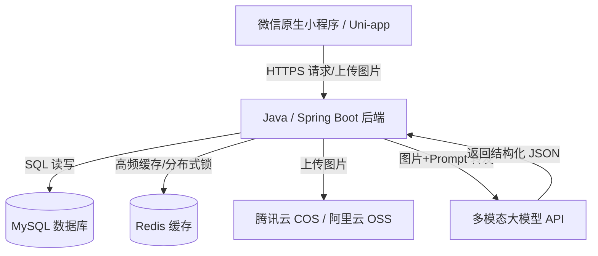

# 食刻 (ShiKe) — 基于 AI 视觉识别的极简热量管理与私密社交小程序
## 项目商业与技术全景规划书 (整合版 v2.0)

---

### 一、 产品定位与核心痛点分析

在当前健康管理与减脂市场中，用户对于热量控制的需求长期存在且具有高粘性。然而，传统的卡路里追踪产品普遍存在难以跨越的“用户摩擦力”。本项目旨在结合“**AI拍照识别**”的便捷性与“**熟人私密对赌**”的社交张力，在低成本、单兵作战（或AI辅助全栈开发）的前提下，跑通一款创新的健康生活小程序。

#### 1. 传统工具的三大痛点与本项目的破局点

*   **痛点一：手动记录繁琐（反人性）**
    *   *传统现状*：要求用户饭后手动搜索“宫保鸡丁 100克”，称重和录入摩擦力极大，导致次周留存率暴跌。
    *   *食刻破局*：**AI 拍照即出结果**。用户随手一拍，AI 自动识别食物、估算重量并返回营养素数据。同时提供**“极简视觉微调”**，允许用户通过滑动条微调分量或油脂度（如：清淡/适中/油腻），极大减少录入摩擦。
*   **痛点二：食物数据库高壁垒（难硬刚）**
    *   *传统现状*：行业巨头花费数百万构建庞大完整的食物结构化库，独立开发者无法正面抗衡。
    *   *食刻破局*：**AI 模糊推理替代结构化大库**。利用多模态视觉大模型的常识推理能力，实时估算中餐复杂的烹饪成分。对普通用户而言，**极简的录入体验与大致准确的趋势**远比绝对精确但极其繁琐的数值更具吸引力。
*   **痛点三：开放社区冷启动极难（无人发）**
    *   *传统现状*：减脂餐（水煮鸡胸肉、蔬菜沙拉）缺乏视觉吸引力，在开放广场中无法获得点赞正反馈，且开发者无预算购买初始流量。
    *   *食刻破局*：**私密对赌小队 + 炫耀式海报**。砍掉大厅式广场社区，转为**“2-5人熟人减脂小分队”**，利用熟人圈子的社交压力和契约机制实现自驱动。同时，支持生成**极具设计感、适合发在现实朋友圈/小红书的打卡海报**，将用户转化为免费的拉新渠道。

---

### 二、 产品功能架构（MVP 阶段）

为了实现快速上线和零成本试错，MVP 阶段聚焦于以下核心功能：

#### 2.1 工具端：极简热量追踪与 AI 识别

1.  **用户健康档案与代谢引擎**：
    *   录入身高、体重、年龄、性别、运动频率。
    *   采用 **Mifflin-St Jeor 公式**自动计算 BMR（基础代谢率）与 TDEE（每日总消耗热量）。
    *   设定减脂/维持/增肌目标，自动定制每日剩余热量预算。
2.  **AI 拍照识别与智能估算**：
    *   调用摄像头或相册上传饮食图片。
    *   Java 后端转发给多模态大模型 API（如 Qwen-VL, GLM-4V, Claude 3.5 Sonnet 或 GPT-4o-mini）。
    *   大模型返回：食物列表、估算克数、总热量、碳水、蛋白质、脂肪。
3.  **极简校准交互（解决 AI 误差）**：
    *   **分量滑块**：如 AI 识别出 150g 苹果，用户可拖动滑块快速校准为 200g，数据自动按比例缩放。
    *   **烹饪度校准**：快捷选择“无油/少油/多油”，后台自动修正脂肪和热量系数。
4.  **热量看板**：
    *   直观的数据大圆环看板：`剩余可摄入热量 = TDEE预算 - 今日已摄入`。
    *   三餐记录明细与三大营养素占比图。

#### 2.2 社交端：低成本自裂变生态

1.  **5人对赌打卡小队**：
    *   用户可创建或加入私密减脂小队（2-5人，熟人为主）。
    *   设定打卡契约（例如：连续 7 天记录饮食，且每日摄入不超过 TDEE 预算）。
    *   引入趣味规则（如未打卡扣减虚拟积分、触发好友监督弹窗提醒），利用熟人社交契约提升粘性。
2.  **高质感打卡海报生成**：
    *   提供多套符合极简美学纹理（磨砂玻璃、莫兰迪色系、日系清新）的打卡海报模板。
    *   一键将今日的卡路里赤字、健康饮食和“自律天数”转化为精美海报。
    *   海报自带小程序码，诱导用户分享至微信朋友圈或小红书，实现有机裂变。

#### 2.3 砍掉的功能（非 MVP 范围）
*   扫码识别食品条形码（规模期再做）
*   附近美食定位（LBS）
*   食谱分步图文教程与发布
*   用户间即时通讯（私信）
*   商城/电商带货功能

---

### 三、 全栈技术选型与架构规划

项目遵循“**Java 筑基稳定性，AI 冲锋生产力**”的敏捷独立开发策略。



#### 3.1 核心技术栈

| 层级 | 技术选型 | 选型理由与考量 |
| :--- | :--- | :--- |
| **前端工程** | **微信原生小程序 / Uni-app** | 国内生态语料最丰富，AI 代码生成器（如 v0, Cursor 等）对其语法掌握度极高，开发效率最快。 |
| **后端核心** | **Java / Spring Boot** | 开发者原生核心技能，保证业务逻辑的严谨性、接口安全稳定与敏捷扩展。 |
| **数据存储** | **MySQL + Redis** | **MySQL**：负责用户、小队及打卡记录的持久化；<br>**Redis**：负责热量预算缓存、全局分布式锁（处理小队结算并发）及高频数据缓存。 |
| **图片存储** | **腾讯云 COS 或 阿里云 OSS** | 微信生态兼容性强，支持低成本对象存储。 |
| **部署运维** | **Docker + 轻量级云服务器** | 结合容器化技术在腾讯云/阿里云的轻量级服务器上一键部署，极大简化运维工作。 |

#### 3.2 AI 视觉接口设计与 Prompt 工程

后端 Java 服务接收前端上传的图片后，将图片流转发至多模态大模型 API。在 HTTP 请求中封装严格的 Prompt 结构以确保返回稳定的 JSON 格式：

```json
{
  "system_instruction": "你是一个严谨且经验丰富的临床营养师。请分析用户上传的餐饮图片。",
  "prompt": "核心任务：\n1. 识别图片中包含的具体食物名称（中文菜品名）。\n2. 结合盘子、餐具与手部常见比例，估算每种食物的近似重量（克）。\n3. 计算该顿餐饮的总热量（Kcal）、蛋白质（g）、脂肪（g）、碳水化合物（g）。\n\n输出限制：必须且只能返回标准的 JSON 数据，严禁包含任何 Markdown 标记、首尾解释性文本或前缀/后缀。\n\n返回格式规范：\n{\n  \"food_items\": [\n    {\"name\": \"食物名称\", \"weight\": 估算重量数值}\n  ],\n  \"calories\": 总热量数值,\n  \"protein\": 蛋白质数值,\n  \"fat\": 脂肪数值,\n  \"carbs\": 碳水化合物数值\n}"
}
```

---

### 四、 开发周期与敏捷迭代计划

在“**独立开发者 + AI 伙伴**”的协作模型下，预计 **3-4 周** 完成 MVP 并上线。

#### 4.1 开发分工
*   **开发者角色**：设计核心业务逻辑，定义表结构，编写核心安全代码（JWT鉴权、小程序登录、对赌结算批处理逻辑），以及审核 AI 产出的成果。
*   **AI 伙伴角色**：
    *   *前端切图*：利用 v0.dev 或 Claude 生成原生小程序 WXML/WXSS/JS 代码。
    *   *脚手架生成*：生成 Spring Boot 基础 CRUD 代码、MySQL DDL 语句、DTO 及实体类转换。
    *   *Debug 助手*：分析编译报错与小程序渲染 Bug，提供修复建议。
    *   *宣发文案*：自动将开发日志（Build in Public）转化为社交媒体引流文案。

#### 4.2 4周里程碑计划

*   **第 1 周：产品定义与基础搭建**
    *   明确 5 个核心页面（登录/档案初始化、首页看板、拍照识别及微调页、小队打卡页、海报分享页）。
    *   后端 Spring Boot 环境搭建，MySQL 建表，接入 Redis。
*   **第 2 周：核心技术闭环跑通**
    *   开发“拍照上传-Java转发大模型-解析为结构化JSON-结果入库”的核心链路。
    *   前端 UI 页面开发，与后端接口初步对接。
*   **第 3 周：社交打卡与海报功能**
    *   开发“5人小队”创建、加入、每日打卡状态同步的逻辑。
    *   实现前端 Canvas 或后台生成精美打卡海报的功能（带小程序太阳码）。
*   **第 4 周：联调测试与 Build in Public 宣发**
    *   进行 10-20 人的微信群内测，修复 Bug。
    *   发布“Build in Public”系列开发日记（如在小红书、即刻、V2EX、掘金发帖），积累首批极客种子用户。

---

### 五、 变现路径与冷启动行动指南

#### 5.1 0预算冷启动策略
*   **Build in Public（公开构建）**：将技术选型、遇到的趣味 Bug、UI 设计稿同步发布在社交网络上。写系列文章《一个 Java 程序员如何靠 AI 0成本撸出一款拍照算热量小程序》进行圈粉。
*   **自裂变链条**：由于打卡是熟人小队模式，第 1 批用户（通过公开构建吸引的极客/减脂人群）为了完成任务，会主动邀请身边的 2-4 个好友组队，从而实现**呈几何级数的自发拉新**。

#### 5.2 变现路径规划

1.  **冷启动期（用户数 < 5,000）**：
    *   专注留存、收集 AI 估算的误差反馈并进行 Prompt 优化，完全免费。
2.  **成长期（用户数 5,000 - 50,000）**：
    *   **食刻集市（UGC 分成）**：允许优质健身打卡达人在小程序内发布付费的“7天科学减脂餐计划”或“私人定制食谱”，平台收取 **20%** 的佣金。
    *   **付费小队功能**：提供官方高级挑战赛（例如用户缴纳押金，由系统自动抽水/返还押金，平台收取少量服务费）。
3.  **规模成熟期（用户数 50,000+）**：
    *   **食刻 Pro 会员**：订阅制变现。提供高级 AI 服务，如“AI 周度饮食健康诊断报告”、“AI 定制减脂食谱推荐”、“体重红绿灯深度分析”。
    *   **健康品牌原生合作**：与低卡食品（魔芋豆腐、全麦面包、鸡胸肉等）品牌进行内容合作，在用户的餐食分析中做软性推荐（例如：“你今天的蛋白质摄入偏少，建议搭配xx无脂鸡胸肉”），拒绝粗暴的弹窗广告。

---

### 六、 风险识别与应对方案

1.  **AI 识别准确率低，导致用户体验差（概率：高 | 影响：高）**
    *   *应对方案*：**界面设计上淡化“绝对精准度”，强调“趋势管理”**。在 AI 识别结果页面提供极其便捷的“克数滑块”和“烹饪油量”微调按钮，引导用户共同校准数据。
2.  **API 接口费用高昂，难以为继（概率：中 | 影响：高）**
    *   *应对方案*：初期使用性价比极高的模型（如国内的 Qwen-VL-Plus，GLM-4V，或 OpenAI GPT-4o-mini，每百万 Token 价格极低）。单次识别成本可控制在 1-2 分钱内。成长期后，对免费用户的每日拍照次数设定限制（如每天免费拍照 3 次，超出需看激励广告或购买次数包）。
3.  **熟人社交圈裂变动力不足（概率：中 | 影响：中）**
    *   *应对方案*：提供系统自动匹配的“野队挑战赛”，让没有熟人搭档的孤狼用户也能参与打卡对赌；并提供极具视觉表现力（而非土味）的“朋友圈打卡海报”模板。
4.  **微信社区安全与审核风险（概率：中 | 影响：高）**
    *   *应对方案*：由于砍掉了大厅式公开广场，仅保留“熟人私密小队”，不涉及全网公开的文字/图片传播，可极大降低敏感内容审核风险，且小程序类目审核更容易通过。

---

*文件生成自：食刻项目合并规划案 v2.0*
