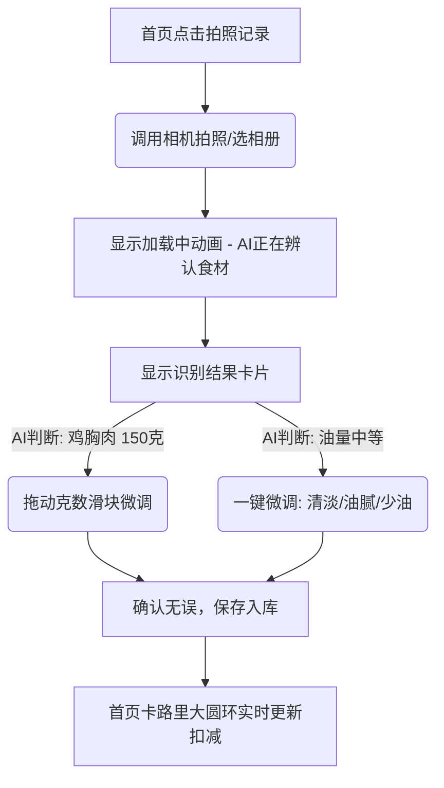
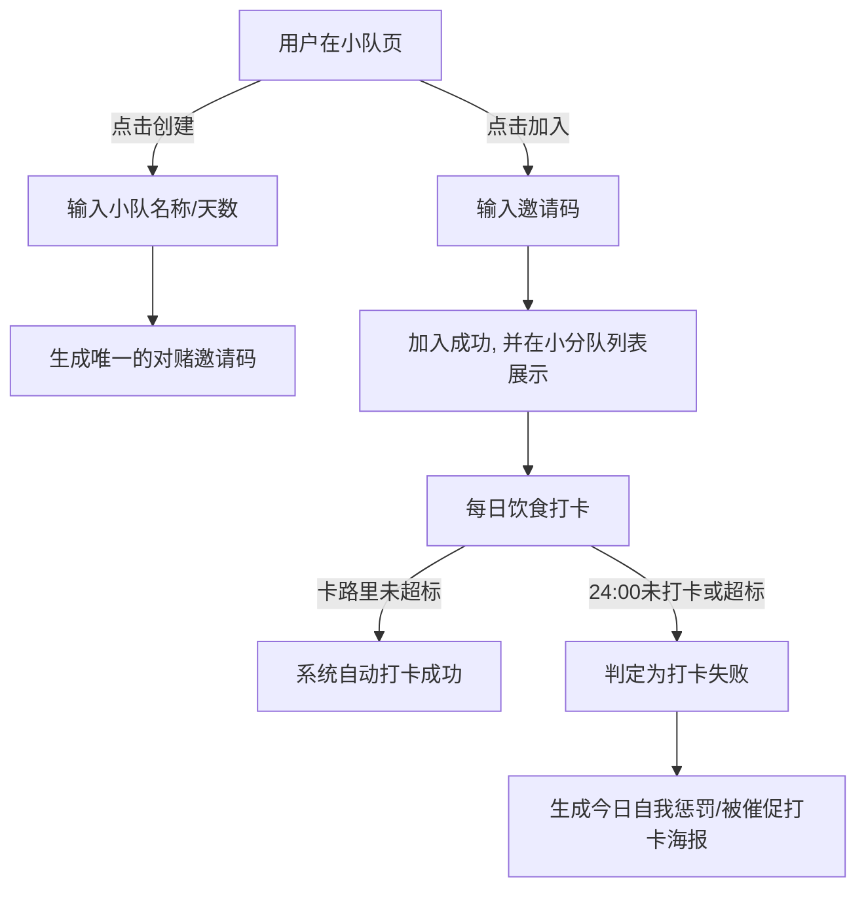

# 食刻 (ShiKe) — UI 视觉风格与交互流程设计
## 视觉与交互规范 (v1.0)

---

### 一、 视觉设计规范 (UI Style Guide)

为了消除传统卡路里记录工具带来的“医疗化、焦虑感”和沉闷，食刻的 UI 视觉定位是：**极简主义、生活感与轻盈**。

#### 1. 色彩规范 (Color Palette)

*   **主色 (Primary)**：`#10B981` (健康翡翠绿 - 传达生机与自然食欲，非焦虑警告红)。
*   **辅助色 (Accent)**：`#6366F1` (丁香紫 - 用于社交、小队对赌以及重要互动提示)。
*   **中性色底色 (Neutral Backgrounds)**：
    *   *浅色模式*：`#F8FAFC` (轻盈乳白) / 纯白卡片 `#FFFFFF`。
    *   *暗色模式*：`#0F172A` (午夜深蓝/深Slate) / 卡片 `#1E293B`。
*   **渐变色 (Gradients)**：
    *   热量圆环进度条：`#10B981` 渐变至 `#34D399`。
    *   对赌获胜海报背景：`#6366F1` (丁香紫) 渐变至 `#8B5CF6`。

#### 2. 质感与组件样式

*   **玻璃拟态 (Glassmorphism)**：列表卡片背景采用轻微毛玻璃效果（半透明背景 + `backdrop-filter: blur(10px)`），增加高端质感。
*   **圆角规范**：小部件圆角统一为 `12rpx`，卡片及海报大圆角统一为 `24rpx`，带来饱满温润的触感。
*   **微动效 (Micro-Animations)**：
    *   点击拍照按钮时：按钮执行轻微缩放呼吸反馈 (`transform: scale(0.95)`)。
    *   热量看板加载时：圆环以环形动画平滑绘制。

---

### 二、 核心交互流程 (Interaction Flow)

#### 1. 饮食拍照识别与快速校准流程 (AI Recognition & Calibration)

*   **克数滑块交互**：用户可以直接拖动进度条或点击 `+/-` 符号，系统按比例实时重新计算卡路里及三大营养素，不需要用户手动打字输入。
*   **烹饪度微调**：点击“少油”热量下调15%，“多油”热量上调20%，极大降低了记录中餐复杂菜品时的摩擦阻力。

#### 2. 对赌小队创建与打卡流程 (Betting Team & Check-in)

---

### 三、 炫耀式打卡海报规范 (Share Poster Spec)

打卡海报是产品实现“自传播”和“低成本冷启动”的关键：

1.  **卡片信息精简化**：只保留最亮眼的数据，如 `“今日达成热量赤字: -500 kcal”`、`“本周已连续打卡 5 天”`，隐去繁琐的每餐明细，防止用户隐私焦虑。
2.  **设计模版化**：提供 3 套极简排版模板（“清晨森林”、“午后暖阳”、“极简几何”），自动拼接用户今日的一张精美餐饮图与打卡打码，极具社交平台传播美感。
