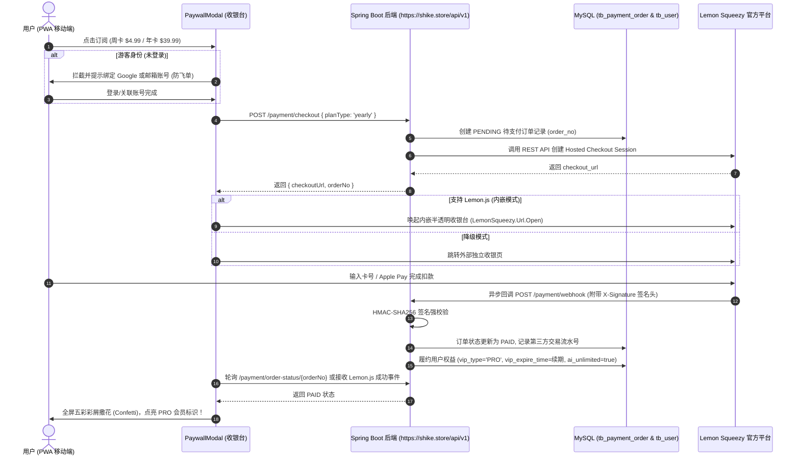

# 🌍 食刻 (ShiKe) — Lemon Squeezy (MoR) 跨境美金订阅与支付系统设计与运维手册

> **最后更新时间**：2026-09-18  
> **适用版本**：食刻 PWA v1.3.0+ / 后端 Spring Boot 3.2+  
> **所属模块**：阶段五 跨境美金订阅与会员商业化闭环  

---

## 目录
1. [系统定位与商业化模型](#1-系统定位与商业化模型)
2. [完整业务架构与时序流程](#2-完整业务架构与时序流程)
3. [数据库表结构与持久化设计](#3-数据库表结构与持久化设计)
4. [后端核心服务与 API 规范](#4-后端核心服务与-api-规范)
5. [Webhook 安全防篡改与自动履约机制](#5-webhook-安全防篡改与自动履约机制)
6. [前端 PWA 收银台与内嵌交互设计](#6-前端-pwa-收银台与内嵌交互设计)
7. [生产商户配置与上线运维指南](#7-生产商户配置与上线运维指南)
8. [开发与沙箱测试指南 (QA Testing)](#8-开发与沙箱测试指南-qa-testing)

---

## 1. 系统定位与商业化模型

### 1.1 为什么选择 Lemon Squeezy (Merchant of Record 模式)
「食刻 (ShiKe)」作为面向全球出海的 PWA 健康饮食工具，跳过了传统苹果 App Store 30% 的抽成与繁琐审核。在跨境收款环节，采用 **Lemon Squeezy (MoR 托管方案)**：
- **无须设立海外离岸公司**：国内开发者凭个人身份证或个体工商户营业执照即可申请入驻。
- **自动代扣全球消费税 (VAT / Sales Tax)**：Lemon Squeezy 作为法律上的记录销售商（MoR），替开发者合规申报并代缴全球各国增值税，规避跨国税务风险。
- **全球主流收单能力**：原生支持全球信用卡（Visa/MasterCard/Amex）、Apple Pay、Google Pay 及 PayPal。
- **便捷资金提现**：支持直接提现至 Payoneer（派安盈）、PingPong 或国内银行外币账户。

### 1.2 订阅方案定价
| 方案名称 | 定价 | 计费周期 | 会员权益 |
| :--- | :--- | :--- | :--- |
| **Weekly Pro (周卡)** | **$4.99 / wk** | 每周自动续费（支持3天免费试用） | 无限次 AI 拍照测卡、隐形油脂沙拉酱修正、深层微量元素建议、好友小队进阶 |
| **Annual Pro (年卡)** | **$39.99 / yr** | 每年自动续费（**立省 65%**，约 $0.76/周） | 同上全部 PRO 权益，享优先大模型推理算力通道 |

---

## 2. 完整业务架构与时序流程



---

## 3. 数据库表结构与持久化设计

### 3.1 订单流水表 `tb_payment_order`
在 MySQL 生产库 `db_shike` 中部署的订单明细物理表：

```sql
CREATE TABLE IF NOT EXISTS `tb_payment_order` (
  `id` BIGINT AUTO_INCREMENT PRIMARY KEY COMMENT '主键ID',
  `order_no` VARCHAR(64) NOT NULL UNIQUE COMMENT '商户内部订单号 (如 LS_ORD_1789712732561_5417EB)',
  `user_id` BIGINT NOT NULL COMMENT '关联的用户ID (tb_user.id)',
  `user_email` VARCHAR(120) DEFAULT NULL COMMENT '用户邮箱',
  `plan_type` VARCHAR(20) NOT NULL COMMENT '套餐类型: WEEKLY, YEARLY',
  `amount` DECIMAL(8,2) NOT NULL COMMENT '订单金额 (4.99 / 39.99)',
  `currency` VARCHAR(10) DEFAULT 'USD' COMMENT '币种 (默认 USD)',
  `status` VARCHAR(20) DEFAULT 'PENDING' COMMENT '状态: PENDING(待付), PAID(已付), CANCELLED(已取消), REFUNDED(已退款)',
  `provider` VARCHAR(20) DEFAULT 'LEMON_SQUEEZY' COMMENT '支付通道: LEMON_SQUEEZY',
  `ls_order_id` VARCHAR(64) DEFAULT NULL COMMENT 'Lemon Squeezy 官方 Order ID',
  `ls_subscription_id` VARCHAR(64) DEFAULT NULL COMMENT 'Lemon Squeezy 官方 Subscription ID (续订凭据)',
  `checkout_url` TEXT DEFAULT NULL COMMENT '收银台跳转 URL',
  `paid_at` DATETIME DEFAULT NULL COMMENT '扣款成功时间',
  `created_at` TIMESTAMP DEFAULT CURRENT_TIMESTAMP COMMENT '创建时间',
  `updated_at` TIMESTAMP DEFAULT CURRENT_TIMESTAMP ON UPDATE CURRENT_TIMESTAMP COMMENT '更新时间',
  INDEX `idx_user_id` (`user_id`),
  INDEX `idx_order_no` (`order_no`),
  INDEX `idx_ls_order_id` (`ls_order_id`)
) ENGINE=InnoDB DEFAULT CHARSET=utf8mb4 COMMENT='支付订单表';
```

### 3.2 用户表字段联动 `tb_user`
用户开通成功后，系统自动修改以下字段：
- `vip_type`: 从 `'NORMAL'` 变更为 `'PRO'`
- `vip_expire_time`: 
  - 若原先已是 VIP 且未过期：在原过期时间基础上往后顺延；
  - 若已过期或首次开通：从当前系统时间往后顺延（周卡 +7天，年卡 +365天）。
- `ai_unlimited`: 置为 `1`（永久无限次 AI 扫描通道，不受单日免费 3 次配额限制）。

---

## 4. 后端核心服务与 API 规范

后端代码目录：`shike-backend/src/main/java/com/shike/`

### 4.1 接口清单

#### ① 创建支付订单与收银台会话
- **路径**：`POST /api/v1/payment/checkout`
- **入参** (JSON)：
  ```json
  {
    "planType": "yearly",  // "weekly" 或 "yearly"
    "userId": 1            // 可选，默认读取请求头 X-User-Id
  }
  ```
- **响应** (ResultDTO)：
  ```json
  {
    "code": 200,
    "message": "success",
    "data": {
      "orderNo": "LS_ORD_1789712732561_5417EB",
      "checkoutUrl": "https://shike.lemonsqueezy.com/buy/...",
      "planType": "YEARLY",
      "amount": 39.99,
      "currency": "USD"
    }
  }
  ```

#### ② 官方 Webhook 异步回调
- **路径**：`POST /api/v1/payment/webhook`
- **请求头**：`X-Signature: <hex_encoded_hmac_sha256>`
- **说明**：支持接收 `order_created`, `subscription_created`, `subscription_updated` 等官方事件。校验通过返回 `200 OK`，若签名错误返回 `401 Unauthorized`。

#### ③ 前端订单状态轮询
- **路径**：`GET /api/v1/payment/order-status/{orderNo}`
- **响应**：
  ```json
  {
    "code": 200,
    "message": "success",
    "data": {
      "orderNo": "LS_ORD_1789712732561_5417EB",
      "status": "PAID",
      "planType": "YEARLY",
      "vipType": "PRO",
      "vipExpireTime": "2027-09-18T14:25:32",
      "aiUnlimited": true,
      "isVipActive": true
    }
  }
  ```

#### ④ 沙箱开发模式一键模拟扣款（免资质研发测试通道）
- **路径**：`POST /api/v1/payment/test-complete/{orderNo}`
- **说明**：在商户审核期间，前端调用此接口可模拟 Lemon Squeezy 发起扣款成功通知，执行完整的落库与 VIP 顺延发放逻辑。

---

## 5. Webhook 安全防篡改与自动履约机制

在 [`PaymentServiceImpl.java`](file:///d:/heming/shike/shike-backend/src/main/java/com/shike/service/impl/PaymentServiceImpl.java) 中实现了工业级安全鉴权：

### 5.1 HMAC-SHA256 签名算法
```java
Mac hmac = Mac.getInstance("HmacSHA256");
SecretKeySpec keySpec = new SecretKeySpec(webhookSecret.trim().getBytes(StandardCharsets.UTF_8), "HmacSHA256");
hmac.init(keySpec);
byte[] hash = hmac.doFinal(rawPayload.getBytes(StandardCharsets.UTF_8));
String expectedSignature = HexFormat.of().formatHex(hash);

boolean matches = expectedSignature.equalsIgnoreCase(signatureHeader.trim());
```
- 使用 JDK 17 原生 `HexFormat` 零额外第三方依赖解析。
- 对未经格式化的原始 Request Body 字节流计算散列，防止因 JSON 反序列化重排导致签名失真。

### 5.2 幂等性防护
- 收到 Webhook 时首先校验订单状态，若订单已为 `PAID`，则不再重复累加时长，防止 Lemon Squeezy 重复重试回调导致时间被无限叠加。

---

## 6. 前端 PWA 收银台与内嵌交互设计

前端代码：`shike-pwa/src/components/PaywallModal.vue`

### 6.1 四步状态机设计
1. **`plans`（套餐选择）**：展示年卡（$39.99 推荐标）与周卡（$4.99），核心权益点对比与随时退订提示。
2. **`bind_account`（游客防飞单拦截）**：
   - 若用户是以游客身份体验，点击付款时自动拦截进入此步。
   - 提供 Google 一键登录或邮箱注册，绑定后自动沿用刚才选择的套餐，确保付费权益永远绑定在用户真实账号上。
3. **`test_checkout`（沙箱收银台）**：在开发或未配官方密钥环境下，展示友好调试面板，提供一键模拟支付按钮。
4. **`success`（履约撒花）**：全屏彩屑爆炸动画（`canvas-confetti`），展示 PRO 尊贵身份徽章，自动刷新 Pinia 全局状态。

### 6.2 Lemon.js 内嵌浮层
在 `index.html` 中引入官方轻量 SDK：
```html
<script src="https://assets.lemonsqueezy.com/lemon.js" defer></script>
```
用户点击付款时，前端直接调用：
```javascript
window.LemonSqueezy.Url.Open(checkoutUrl)
```
收银台将直接浮动在 PWA 界面中央，完成支付后窗口自动关闭，用户体验与原生应用毫无二致。

---

## 7. 生产商户配置与上线运维指南

当您的 Lemon Squeezy 官方商户审核通过后，只需按以下步骤配置，无需修改任何代码：

### 步骤 1：在 Lemon Squeezy 平台创建商品
1. 登录 [Lemon Squeezy Dashboard](https://app.lemonsqueezy.com)。
2. 进入 **Store -> Products -> New Product**：
   - **Product 1**：创建 `ShiKe Pro Weekly`（周订阅，价格 $4.99，启用 3 天 Trial）。
   - **Product 2**：创建 `ShiKe Pro Annual`（年订阅，价格 $39.99）。
3. 复制两个商品对应的 **Variant ID**（数字或字符串）。

### 步骤 2：配置官方 Webhook 回调
1. 在 Dashboard 进入 **Settings -> Webhooks**，点击 **Add Webhook**。
2. **Callback URL** 填写：`https://shike.store/api/v1/payment/webhook`。
3. **Secret**：设置一段随机高强度密码（如 `ShikePay2026!SecureKey`）。
4. **Events**：勾选 `order_created`, `subscription_created`, `subscription_updated`。

### 步骤 3：在阿里云 ECS 生产环境注入环境变量
登录服务器并在 `/root/shike/docker-compose.yml` 或系统环境中配置：
```yaml
environment:
  - LEMON_SQUEEZY_API_KEY=eyJhbGciOi...您的API_KEY
  - LEMON_SQUEEZY_STORE_ID=123456
  - LEMON_SQUEEZY_WEBHOOK_SECRET=ShikePay2026!SecureKey
  - LEMON_SQUEEZY_VARIANT_WEEKLY=78901
  - LEMON_SQUEEZY_VARIANT_YEARLY=78902
  - LEMON_SQUEEZY_REDIRECT_URL=https://shike-two.vercel.app/profile?payment=success
```
然后重启容器应用：
```bash
docker compose up -d shike-app
```

---

## 8. 开发与沙箱测试指南 (QA Testing)

系统内置了完整的自动化调试脚本，位于 `scratch/` 目录下：

| 脚本文件 | 用途说明 | 执行命令 |
| :--- | :--- | :--- |
| `scratch/test_payment_api.py` | 测试线上创建订单、查询状态与模拟履约 | `python scratch/test_payment_api.py` |
| `scratch/test_webhook.py` | 测试 Webhook 接收与 HMAC 验签机制 | `python scratch/test_webhook.py` |
| `scratch/test_refund_api.py` | 测试线上创建订单、支付履约、即时退款与 VIP 权限自动回收 | `python scratch/test_refund_api.py` |

**开发测试快捷指令**：
- 前端测试：直接在 PWA 个人中心点击「升级 Pro 会员」，在弹窗中选择年卡后点击「立即开通」，沙箱模式下点击「一键模拟测试扣款成功」，即可立即体验完整的 VIP 升级流程与撒花动效。

---

## 9. 退款机制深度设计与海外标杆行业策略

### 9.1 行业标杆对标：Cal AI 与海外顶级订阅 App 是如何处理退款的？
在消费级健康/AI 应用领域（如 Cal AI, Noom, Flo, Duolingo, BetterMe），**绝对不在 App 内提供“一键全自动即时退款”按钮**。
原因如下：
1. **防恶意刷单与羊毛党**：如果开放应用内一键无审核退款，会有大量用户在生成深度分析或拍照识别后立即退款白嫖算力，导致极高的算力损耗与虚假退款率（Churn Rate 激增）。
2. **保障风控与降低拒付率 (Chargeback Rate)**：海外支付网关（Stripe / Lemon Squeezy）对商户的“信用卡拒付与拒付争议 (Dispute)”有极其严苛的红线指标（通常要求小于 1%）。若用户找不到退款途径或无法联系客服，往往会直接向发卡行发起拒付争议，导致商户被罚款甚至封店。

### 9.2 食刻 (ShiKe) 实施的退款与合规标准闭环
1. **公开透明的「14 天无条件满意保障」政策 (14-Day Money-Back Guarantee)**：
   - 首次扣款后 14 自然日内均可申请全额原路退款。
   - 在个人中心设置列表 (`ProfileView.vue`) 和付费弹窗底部 (`PaywallModal.vue`) 醒目展示。
2. **便捷的客户支持通道与邮件直达**：
   - 官方客服邮箱：`support@shike.store`。
   - 点击「一键向客服发送退款申请邮件」按钮，自动唤起本地邮件客户端，并预填好邮件主题（`Refund Request`）与格式（含注册邮箱、订单编号、申请原因）。
   - 服务 SLA 承诺：24~48 小时内完成审核确认，并原路退回至用户支付原卡（3~5 个工作日入账）。
3. **用户自主管理与取消自动续订 (Self-Service Cancel Subscription)**：
   - 对于仅希望下个计费周期不再扣费的用户，无需联系客服，PRO 会员个人中心直接提供「管理我的订阅」入口。
   - 直达 Lemon Squeezy 客户官方门户：`https://app.lemonsqueezy.com/my-orders`。
   - 用户可自主查看历史收据发票、更换信用卡卡号，或一键关闭下期自动续费（保留当前周期的 PRO 会员剩余有效期）。

---

## 10. Lemon Squeezy 海外商户审核必备四大刚性合规页面

Lemon Squeezy 与主流信用卡卡组织在审核出海 SaaS / 独立开发者产品时，必须在产品内可直接点击查看以下 4 项合法合规条款。食刻通过前端弹窗组件 `LegalModal.vue` 完整落地了中英双语版：

1. **退款政策 (Refund Policy)**：
   - 详述 14 天退款保障、申请资格、邮箱渠道、处理时效及取消续订指南。
2. **服务条款 (Terms of Service)**：
   - 包含健康与营养免责声明（AI 识别仅供参考，不作为医疗建议与临床处方）、订阅自动续期条款、账户终止规则。
3. **隐私权政策 (Privacy Policy)**：
   - 符合欧盟 GDPR 与加州 CCPA 规范，明确用户餐食照片仅用于多模态 AI 营养识别与提取，不向第三方广告商转卖数据。
   - 个人中心内置「彻底注销账户并删除所有数据」的一键抹除功能。
4. **客户支持与联系方式 (Contact & Support)**：
   - 明确标出官方支持邮箱（`support@shike.store`）、7x24 小时工单时效以及记录销售商（MoR: Lemon Squeezy, LLC）。

---

## 11. 退款自动化 Webhook 与权限回收技术实现

### 11.1 Webhook 事件监听矩阵
在后端的 `PaymentServiceImpl.java` 中，已集成对退款与订阅状态的深度监听：

| Webhook 事件 (`event_name`) | 触发时机 | 业务逻辑处理与资产更新 |
| :--- | :--- | :--- |
| `order_created` / `subscription_created` | 订单支付成功 | 状态设为 `PAID`，开通 PRO 会员 (`vipType='PRO'`)，开启 `aiUnlimited=true` |
| `order_refunded` | 平台或管理员同意退款 | 状态设为 `REFUNDED`，**立即回收 VIP 权限** (`vipType='NORMAL'`, `aiUnlimited=false`) |
| `subscription_cancelled` | 用户取消下期续订 | 记录日志，状态设为 `CANCELLED`，**不剥夺当前已付费周期权益**，到期后正常转为普通用户 |

### 11.2 后端权限回收核心实现代码
```java
private void revokeUserVip(Long userId) {
    User user = userMapper.selectById(userId);
    if (user != null) {
        user.setVipType("NORMAL");
        user.setVipExpireTime(LocalDateTime.now());
        user.setAiUnlimited(false);
        userMapper.updateById(user);
        log.info("Successfully revoked VIP for user: {}", userId);
    }
}
```

### 11.3 线上测试与验证命令
针对开发与沙箱测试，后端提供了无需等待第三方网关的测试退款接口：
```http
POST https://shike.store/api/v1/payment/test-refund/{orderNo}
```
运行本地自动化验证脚本：
```bash
python scratch/test_refund_api.py
```
**实测结果**：
1. 创建订单并模拟支付：`vipType: PRO`, `aiUnlimited: true`
2. 触发退款接口：订单状态变为 `REFUNDED`
3. 用户表数据即时回收：`vipType: NORMAL`, `aiUnlimited: false`, `vipExpireTime: 2026-09-18`

