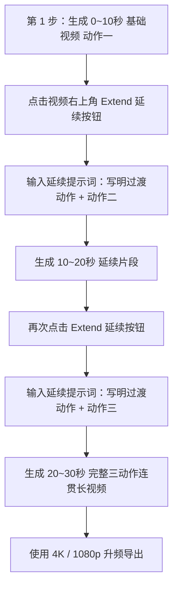

# 🎬 Google Flow (Gemini Omni 1.1 Flash) 视频延续功能实战指南与 3 动作一镜到底连贯提示词库

> **基于 Google 2026 年最新发布的 Gemini Omni 1.1 Flash 视频大模型更新**：  
> 该模型具备**长达 10 秒的前置视频全局上下文感知能力**，支持单次 **10 秒增量延续（Extension）**，累计最长可达 **40 秒**无缝长视频。  
> 本指南专为**将 3 个健身/体态动作无缝衔接在同一支视频（一镜到底）中**而设计。

---

## 🛠️ 一、 Google Flow (Omni 1.1) 延续功能核心机制与操作 SOP



### 1. 延续功能（Scene Extension）三大核心特性：
1. **10 秒全局上下文感知**：Omni 1.1 不仅抓取上一视频的最后一帧，而是**理解前 10 秒整段运动的物理动量与人物状态**，能够平滑处理转身、换腿等过渡；
2. **10 秒增量递进**：每次点击 `Extend` 增加 10 秒，最多可连续叠加 3 次达到 **40 秒**；
3. **草稿流（Draft-then-Upscale）**：在创作测试阶段，**务必先选用 360p 草稿模式**测试 3 个动作的衔接连贯性（生成速度提升 60%，算力成本节省 65%），确认动作无畸变后再点击 **Upscale to 4K** 输出。

### 2. 保证人物与场景“零漂移、不换装、不瞬移”的 3 大心法：
* **心法一：绝对锁定锚定词（Subject & Scene Anchor）**：  
  在每次延续时，必须重复相同的角色定语（如 `same East Asian woman, same blush-pink crop top and grey leggings, same cream bedroom`）；
* **心法二：在提示词中显式描述“过渡动作（Transition Action）”**：  
  AI 不懂魔法换姿势，必须告诉它：`动作一完成 -> 自然侧身 -> 摆好动作二姿势 -> 开始动作二`；
* **心法三：显式写入单镜头指令（Negative Commands）**：  
  在提示词末尾加入指令句：`Continuous single take, no cuts, seamless transition, no sudden posture jump, keep consistent lighting and clothing`。

---

## 🎯 二、 实战案例：大腿内侧赘肉与假胯宽（3大动作一镜到底连续 Prompt）

* **视频总时长**：30 秒（0~10s 动作一 $\rightarrow$ 10~20s 动作二 $\rightarrow$ 20~30s 动作三）
* **动作组合**：`仰卧青蛙夹腿` $\rightarrow$ `平稳侧身` $\rightarrow$ `侧卧蚌式开合` $\rightarrow$ `下方腿伸直` $\rightarrow$ `侧卧下侧腿悬空提拉`

---

### 🟢 阶段一：0~10 秒【基础视频】—— 仰卧青蛙夹腿 + 侧身过渡准备

* **操作**：在 Google Flow 新建项目，选择 **Gemini Omni 1.1 Flash**，生成第一段 10 秒视频。

* **🇨🇳 中文提示词（Google Flow 中文界面直接用）**：
  ```text
  9:16竖屏，45度侧俯角中景固定机位。
  【人物与场景】：一位身材匀称纤细的年轻亚洲女性，扎着干净马尾，身穿浅粉色修身运动抹胸和深灰色高腰瑜伽裤，平躺在温馨明亮的现代奶油风卧室地板瑜伽垫上。
  【动作演示 (0~7秒)】：仰卧青蛙脚跟相抵夹腿。她屈膝双脚悬空，脚跟死死相对相贴，双膝向两侧打开如青蛙状。后腰压实垫面，缓慢呼气时大腿内侧发力将双膝向中间夹紧并停顿1秒，吸气时缓慢向两侧打开，动作匀速完成2次。
  【过渡动作 (8~10秒)】：完成夹腿后，她双脚平稳落回垫面，身体顺势自然向右侧翻身侧卧，双腿微屈叠放，头枕右臂，为下一个侧卧动作做好准备。
  【画质与镜头】：一镜到底单镜头拍摄，柔和晨光透过白色窗帘，4K超高清，真实肌肉质感，60fps极其流畅自然，无剪辑切换。
  ```

* **🇺🇸 英文提示词（推荐，Omni 1.1 英文理解最精准）**：
  ```text
  Vertical 9:16 video, 45-degree angled medium static shot.
  [Subject & Environment]: A slender, athletic young East Asian woman with hair in a clean ponytail, wearing a pale blush-pink sports bra and dark grey high-waist yoga leggings, lying on a mat in a bright, sunlit cream-toned minimalist bedroom.
  [Movement (0-7s)]: Frog leg press exercise. Lying on her back with lower back flat, soles of feet together, knees spread wide. She smoothly squeezes her knees together using inner thigh muscles, pausing for 1 second at the top, then slowly opens them back out with control.
  [Transition (8-10s)]: She lowers her feet, smoothly and naturally rolls onto her right side into a relaxed side-lying posture with knees stacked and head resting on her right arm.
  [Style]: Continuous single take, no cuts, soft natural morning sunlight, 4K resolution, 60fps, photorealistic anatomical consistency.
  ```

---

### 🟡 阶段二：10~20 秒【第 1 次延续】—— 侧卧蚌式开合外旋 + 跨腿过渡准备

* **操作**：在生成的第 1 段视频上点击右上角 **`Extend`（延续）**，输入以下提示词生成 10~20 秒。

* **🇨🇳 中文提示词**：
  ```text
  延续前置视频动作，一镜到底无任何镜头切换。
  【人物保持】：同一位亚洲女性，完全相同的浅粉色运动抹胸、深灰瑜伽裤与奶油风卧室光影。
  【动作演示 (10~17秒)】：侧卧蚌式开合外旋。保持侧卧姿态，双腿屈膝90度，双脚脚跟并拢贴紧，骨盆保持垂直床面不后翻。呼气时臀中肌发力，将上方左膝平稳向上向外旋转打开至45度，在最高点停顿收缩2秒，随后吸气极其缓慢地回落合拢，标准匀速完成2次。
  【过渡动作 (18~20秒)】：做完蚌式开合后，她顺势将上方左腿向前跨过，屈膝脚掌平踩在身前垫面上，下方右腿完全伸直贴地，脚尖勾起，准备进入内侧腿提拉。
  【镜头与要求】：无缝延续前一秒姿态，绝对保持同一场景与服装，固定机位，动作平滑无瞬移，4K高清60fps。
  ```

* **🇺🇸 英文提示词**：
  ```text
  Seamless continuation from the previous frame in one unbroken shot.
  [Subject Consistency]: Exactly the same East Asian woman, same pale pink crop top, dark grey leggings, and same sunlit cream bedroom.
  [Movement (10-17s)]: Side-lying clamshell. Lying on her side with knees bent at 90 degrees and heels glued together. With pelvis held vertical, she smoothly rotates her top left knee upward to 45 degrees, pauses 2 seconds at peak glute contraction, then slowly lowers it back down, completing 2 controlled reps.
  [Transition (18-20s)]: She smoothly steps her top left foot across and flat on the floor in front of her, while straightening her bottom right leg completely with foot flexed, setting up for inner thigh lifts.
  [Style]: Single continuous camera, no jump cuts, consistent lighting and character identity, photorealistic 4K, 60fps.
  ```

---

### 🔴 阶段三：20~30 秒【第 2 次延续】—— 侧卧下侧腿悬空提拉 + 收式放松

* **操作**：在第 2 段延续视频上再次点击 **`Extend`（延续）**，输入以下提示词生成 20~30 秒。

* **🇨🇳 中文提示词**：
  ```text
  延续前置视频动作，一镜到底无任何画面剪辑。
  【人物保持】：同一位亚洲女性，完全相同的服装、发型与温馨室内光影。
  【动作演示 (20~27秒)】：侧卧下侧腿悬空提拉。上方左腿屈膝踩在身前固定，下方右腿保持完全伸直勾脚尖。呼气时大腿内收肌发力，将下方直腿平稳向上抬离地面约20厘米，最高点停顿1秒，随后极其缓慢地下放至接近地面但不触碰，匀速完成2次提拉。
  【收式结语 (28~30秒)】：提拉完成后，下方腿轻柔放回垫面，她放松呼出一口气，转头面向镜头露出自信轻松的微笑，手轻抚大腿侧面示意完成。
  【镜头与要求】：无缝一镜到底，肢体结构精准无畸变，光影连贯，4K超清渲染输出。
  ```

* **🇺🇸 英文提示词**：
  ```text
  Seamless continuation from the previous frame to conclude the routine in one single take.
  [Subject Consistency]: Exactly the same East Asian woman, identical outfit, hairstyle, and soft bedroom lighting.
  [Movement (20-27s)]: Inner thigh leg lift. Top leg remains stepped in front, bottom right leg straight with flexed ankle. She smoothly lifts the straight bottom leg upward 20cm off the mat using her inner thigh, pauses for 1 second at the top, and lowers it slowly without touching the floor, performing 2 clean reps.
  [Outro (28-30s)]: She rests her leg down gently, relaxes her posture, looks towards the camera with a confident, friendly smile, and gently pats her thigh indicating the workout is complete.
  [Style]: Continuous cinematic take, perfect anatomical continuity, ultra-realistic 4K, 60fps.
  ```

---

## 💡 三、 Google Flow 调试排坑秘籍（解决常见翻车问题）

| 常见问题 | 产生原因 | 针对性解决方案 |
| :--- | :--- | :--- |
| **人物变脸 / 换衣服** | 延续提示词中未重复写主体定语 | 在每次延续提示词开头必须加入：`Same woman, identical pale pink top and grey leggings` |
| **动作突然跳跃/瞬移** | 上一段结尾与下一段开头姿势跨度太大 | 必须在上一个 10s 的最后 2 秒加入**【过渡动作（Transition）】**描述 |
| **多长出手脚/肢体变形** | 动作描述太复杂，AI 物理运算冲突 | 加入 `slow and controlled movement`（慢速控制），避免剧烈翻滚或高速摆动 |
| **生成画面光影突变** | 延续时未指定光源方向 | 在提示词末尾统一加上 `same static lighting, soft morning sun from side window` |
| **算力消耗过快** | 直接用 1080p/4K 盲测 | **先开 360p Draft 模式连测 3 段**，确认动作衔接完美后，一键点击 `Upscale to 4K` 升频输出 |
